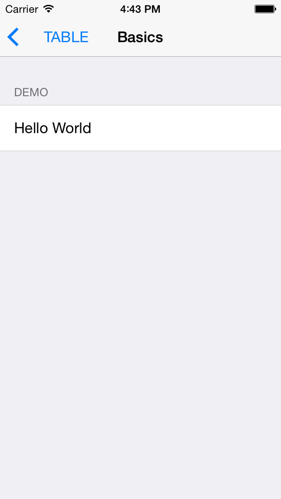

# Declarative Settings
## Declarative Settings table provides a powerful declarative API for working with UITableView's. 

Table views are the foundation of almost every iOS application, but they're also one of the trickiest controls to master. `UITableView`'s out of the box are driven using an imperative API using the table's data source and delegate protocol. Whilst infinitely extensible, this design pattern can quickly become hard to manage and out of control for more ambitious table views. 

## Basic Example

Take the basic table view pictured below.



### Imperative API (Apple's)

Creating this table view using Apple's API looks a little like this:

```objective-c
- (void)viewDidLoad
{
    [super viewDidLoad];
    
    self.title = @"Basics";
    
    [self.tableView registerClass:[UITableViewCell class] forCellReuseIdentifier:@"Cell"];
}

- (UITableViewCell *)tableView:(UITableView *)tableView cellForRowAtIndexPath:(NSIndexPath *)indexPath
{
    UITableViewCell *cell = [tableView dequeueReusableCellWithIdentifier:@"Cell" forIndexPath:indexPath];
    
    if (indexPath.row == 0) {
        cell.textLabel.text = @"Hello World";
    }
    
    return cell;
}

- (NSInteger)numberOfSectionsInTableView:(UITableView *)tableView
{
    return 1;
}

- (NSInteger)tableView:(UITableView *)tableView numberOfRowsInSection:(NSInteger)section
{
    return 1;
}

- (void)tableView:(UITableView *)tableView didDeselectRowAtIndexPath:(NSIndexPath *)indexPath
{
    if (indexPath.row == 0) {
        NSLog(@"Excellent choice!");
    }
}

- (NSString *)tableView:(UITableView *)tableView titleForHeaderInSection:(NSInteger)section
{
    return @"Demo";
}
```

We use a delegate and data source to specify everything, and we need to use indexPath's to check if it is indeed the first row that has been selected.
	
### Declarative API

Creating the same table view using Declarative Settings looks like this:

```objective-c
- (void)viewDidLoad
{
    [super viewDidLoad];
    
    self.title = @"Basics";
    [self addSectionWithSectionTitle:@"Audio Codec" identifier:@"Audio" items:^NSArray * {

        TitleItemModel *demo = [[TitleItemModel alloc] initWithTitle:@"Demo" selection:^(SelectionModel *selection) {
            NSLog(@"Selection happened!");
        }];
        
        return @[demo];
    }];
}
```
	
As you can see it's far more succinct, requiring dramatically less code. All our table logic is in one place, rather than spread out between multiple method calls, meaning we can quickly deduce what the table views structure will be.

## BaseItemModel Protocol 

BaseItemModel specifies view model protocol which has its cell view class, so you can insert cells directly in table view.

Take the below example of a ButtonItem object. 

```objective-c
@implementation ButtonItemModel

- (instancetype)initWithTitle:(NSString *)title data:(id)data clickedBlock:(void (^)())clickedBlock {
	self = [super initWithTitle:title];
	if (self) {
		_backgroundColor = [UIColor clearColor];
		_textColor = [UIColor blackColor];
		_leading = 10;
		_trailing = 10;
		_top = 10;
		_bottom = 10;
		_cornerRadius = 0;
		_clickedBlock = [clickedBlock copy];
	}
	return self;
}

- (instancetype)initWithTitle:(NSString *)title clickedBlock:(void (^)())clickedBlock {
	return [self initWithTitle:title data:nil clickedBlock:clickedBlock];
}

- (Class)viewClass {
	return [SettingButtonCell class];
}

@end

```

Looks very simple, right?

The object describes how it should be presented in the table view - it specifies the cell button colours, labels and can have clickedBlock handler as well, viewCalss specifies what `UITableViewCell` subclass should be used. The object also has the opportunity to perform manual configuration. If you've ever used `MKAnnotation` before, this design should be familiar to you.

The corresponding `SettingButtonCell` can be presented as:

```objective-c
@interface SettingButtonCell()
@property (weak, nonatomic) IBOutlet NSLayoutConstraint *leading;
@property (weak, nonatomic) IBOutlet NSLayoutConstraint *bottom;
@property (weak, nonatomic) IBOutlet NSLayoutConstraint *trailing;
@property (weak, nonatomic) IBOutlet NSLayoutConstraint *top;

@end

@implementation SettingButtonCell

@synthesize model = _model;

- (void)setModel:(ButtonItemModel *)model {
	_model = model;
	
	[self.button setTitle:model.title forState:UIControlStateNormal];
	[self.button setTitleColor:model.textColor forState:UIControlStateNormal];
	self.button.backgroundColor = model.backgroundColor;
	
	if (model.cornerRadius > 0) {
            self.button.layer.cornerRadius = model.cornerRadius;
            self.button.layer.masksToBounds = YES;
	}
	
	self.leading.constant = model.leading;
	self.trailing.constant = model.trailing;
	self.top.constant = model.top;
	self.bottom.constant = model.bottom;
}

- (IBAction)buttonClicked:(id)sender {
	ButtonItemModel *model = (id)self.model;
	
	if (model.clickedBlock != nil) {
		model.clickedBlock();
	}
}

@end
```


## Automatic Cell Height Calculation 

Specify auto layout constraints, table view will rule them all.

## Getting Started

- Download the project and have a play with the Demo app. 
- Include the DeclarativeSettings project in your workspace.
- Add header search paths.
- Import headers where appropriate. 
- Use the `BaseSettingsController` as your view controller class. 

## Project Status

Think of Declarative Settings as a helper for building and prototyping simple settings every application has.

## Maintainers 

- Anton Sokolchenko


## License 

DeclarativeSettings is available under the MIT license. See the LICENSE file for more info.
